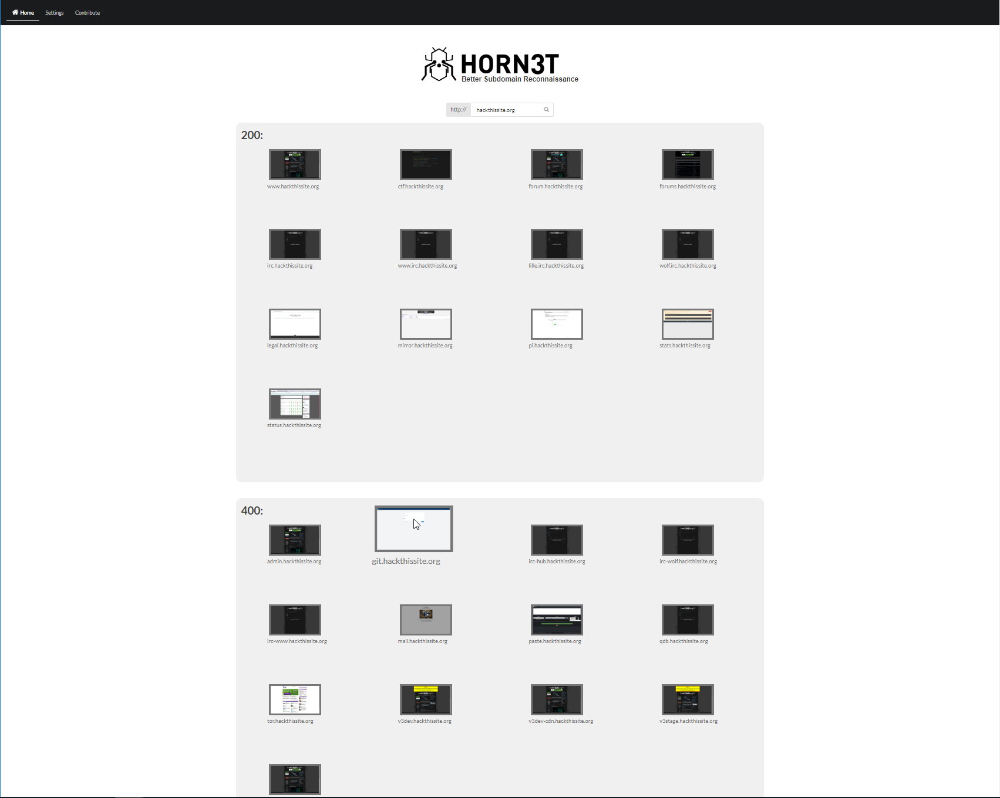

# Horn3t 🐝 - Better Subdomain Reconnaissance

- **Recon** your targets at blazing speed
- **Enhance** your productivity by focusing on interesting *looking* sites
- **Enumerate** critical sites immediately
- **Sting** your target 

Horn3t is your Nr #1 tool for exploring subdomains visually.  
Building on the great Sublist3r framework (or extensible with your favorite one) it searches for subdomains and generates awesome picture previews. Get a fast overview of your target with http status codes, add custom found subdomains and directly access found urls with one click.

# Installation
- Install Google Chrome
- Install requirements.txt with pip3
- Install requirements.txt of sublist3r with pip3
- Put the directory within the web server of your choice
- Make sure to have the right permissions
- Run horn3t.py

Or alternatively use the [install.sh](install.sh) file with docker.  
Afterwards you can access the web portal under [http://localhost:1337](http://localhost:1337)

# Todo
- Better Scaling on Firefox
- Add Windows Dockerfile
- Direkt Nmap Support per click on a subdomain
- Direkt Dirb Support per click on a subdomain
- Generate PDF Reports of found subdomains
- Assist with subdomain takeover

## License

Horn3t is licensed under the GNU GPL license. take a look at the [LICENSE](https://github.com/JannisKirschner/Horn3t/blob/master/LICENSE) for more information.

Respect legal restrictions and only conduct testing against infrastructure that you have permission to target.

## Credits

* [aboul3la](https://github.com/aboul3la/sublist3r) - The creator of **Sublist3r**; turbolist3r adds some features but is otherwise a near clone of sublist3r. 
* [TheRook](https://github.com/TheRook/) - The bruteforce module was based on his script **subbrute**.
* [bitquark](https://github.com/bitquark) - The Subbrute's wordlist was based on his research **dnspop**.
    
     
**Tested on Windows 10 and Debian with Google Chrome/Chromium 73**
